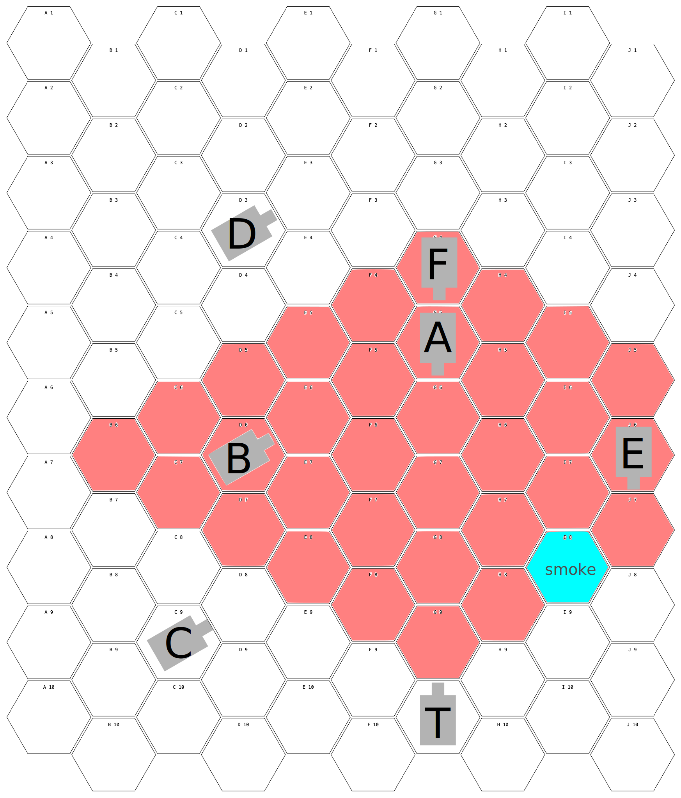

# Tank Commander

## Introduction

**Tank Commander** is a simple table-top game where two players take turns to shoot at each other's tanks. The game is played on a hexagonal grid, and each player has a tank that can move and shoot in six directions. The simplest goal of the game is to destroy the opponent's units.

Players take turns activating a unit, performing a number of actions with it, and then ending their turn. The battle is over when the mission is complete, or a player concedes, or after 10 turns of play.

This game is still in early development. If you want to give it a try, please give feedback in the form of an issue or pull request to update or clarify rules.

I've 3D printed some models for the game, based on Epic-scale Warhammer 40k Imperial Guard models:
- Battle Tank _(TODO)_
- [Armored Personnel Carrier](https://cults3d.com/en/3d-model/game/epic-scale-mechanized-infantry-vehicle)
- [Infantry Squad](https://cults3d.com/en/3d-model/game/epic-scale-infantry-company)

## Building your Tank

The basic tank starts with the following stats:

| Armor | Accuracy | Hull Points | Actions |
|-------|----------|-------------|---------|
| 6/6/6 | 4+       | 4           | 5       |

It has a main turret gun with anti-tank (AT) rounds, with a range of 6 spaces.

Before the game begins, players can upgrade their tanks, spending up to 10 upgrade points on the following items:

- **Armor (1 point per facing, max 3 per facing)**: Increases the armor of the tank by 1 point.
  - Side armor cannot exceed front armor.
  - Rear armor cannot exceed side armor.
- **Engine Upgrade** (1 upgrade point): Increases the movement range of the tank by 1.
- **Extended Barrel** (1 upgrade point): Increases the range of the main gun by 1.
- **Enhanced Optics** (1 upgrade point): Increases the accuracy of the main gun by 1.
- **High-Explosive (HE) Rounds** (1 upgrade point): Allows HE rounds to be loaded.
- **Anti-Infantry Weapons** (1 upgrade point): Allows the tank to fire at infantry units at a range of 2 spaces.
- **Smoke Launcher** (1 upgrade point): Allows the tank to deploy smoke, blocking line of sight through one space within a range of 2 spaces.
- **Medkit** (1 upgrade point): The first time a crew member is injured, it does not observe the penalty for being injured.
- **Lieutenant Commander** (1 upgrade point): Adds a Lieutenant Commander to the crew.
- (Advanced) **Air Support** (2 upgrade points): Allows the tank to call in an air strike during the battle.
- (Advanced) **Anti-Tank Mines** (1 upgrade point, max 3): Allows the tank to deploy anti-tank mines.

For example, a tank could spend its upgrade points on the following upgrades:
- Armor: Front 8, Side 8, Rear 6 (4 points)
- Engine, Barrel, Optics: 3 points total
- Lieutenant Commander: 1 point
- Air Support: 2 points

Tanks that are painted get an extra upgrade point. Tanks that are given a suitably epic name and have named crew members get an extra upgrade point.

### Crew

The tank has a crew of 4 members. Once per battle, each crew member can use a special ability (only one per turn):

- The **Commander** commands the tank
  - _Booming Voice_: the tank may use 2 extra actions
- The **Driver** moves the tank
  - _"Move move move!"_: the tank can move twice for one action, or move three spaces straight ahead
- The **Gunner** fires the turret gun and any other weapons
  - _"Bring it down!"_: the gunner hits on 2+ for this turn
- The **Loader** loads the main gun
  - _Quick Load_: loading costs zero actions for this turn

The tank may also add a fifth crew member for 1 upgrade point.
- The **Lieutenant Commander** can take over any role if the crew member is killed.

## Playing the Game

Players roll a die to determine who goes first. The player who rolls the highest number goes first.

On their turn, the player can perform actions by spending action points:

- **Move**: Move the tank forward one space, max 3 spaces per turn.
- **Turn**: Rotate to the left or right 60 degrees. The turret may turn with the tank or remain in its current direction.
- **Rotate Turret**: Rotate the turret relative to the tank to the left or right 60 degrees.
- **Fire**: Fire the loaded round at a target within range.
- **Load**: Load a round into the main gun. This is required before firing. (The gun starts the battle loaded with any available rounds)
- **Fire Anti-Infantry Weapon**: Fire the anti-infantry weapon at a target within range.
- **Deploy Smoke**: Deploy smoke, blocking line of sight through a space until the end of the battle.
- **Extinguish Fire**: Extinguish a fire on the tank.
- (Advanced) **Air Strike**: See Air Strike rules below. This can only be done once per battle.

### Firing the Main Turret Gun

#### Identify a Target

First, select a target within range, and visible to the turret's current facing.

A target is visible if a line can be drawn from the center of the firing tank's space to the center of the target's, without going through any squares occupied by another tank or terrain or smoke.

See [Firing Diagram](firing.svg) for an example:

- Tank **T** can fire at tanks **A** and **B**
- Tank **C** is outside the turret's facing
- Tank **D** is outside the gun's range.
- Tank **E** is obscured by smoke.
- Tank **F** is obscured by **A**.
- **T** would inflict damage against **A**'s front facing armor
- **T** would inflict damage against **B**'s side facing armor

On its turn, **C** could fire at **T**, inflicting damage against its side facing armor. **A** could fire at **T** against its front facing armor.

**B**, **E** and **F** could not fire at **T** due to turret facing, smoke, and **A**, respectively.

#### Roll to hit

The player must roll equal to or higher than their accuracy score to hit. If the shot hits, roll a die and add the round's strength. If the result is more than the target's armor on the the side where it was hit, the target takes a penetrating hit. Otherwise, it's a glancing hit.

AT rounds have a strength of 6, HE rounds have a strength of 4.

#### Inflicting Damage

A glancing hit wounds a random living crew member on a 4+. When a crew member is wounded, randomly select a living crew member to be wounded. If a wounded crew member is wounded again, they are killed.

A penetrating hit always wounds a random living crew member, and reduces the tank's hull points by 1. If the target's hull points are reduced to 0, the tank is disabled -- it cannot perform any actions, and remains on the table until the end of the battle.

Additionally, a glancing or penetrating hit from an HE round can start a **Fire**. Roll a die. On a 5+, the tank is _on fire_. The tank's crew can use an action to extinguish the fire in their turn. If the fire is not extinguished, the tank loses 1 hull point at the end of each turn until the fire is extinguished, or the tank is destroyed.

At the end of every turn a disabled tank is on the table (including the turn it was disabled), roll a die. On a 4+, the ammunition cooks off. The tank is destroyed, and any units within 2 spaces of the tank are hit with an HE round with a strength of 4. The vehicle is replaced with a rubble terrain piece. If the tank's last hull point was lost to **Fire**, the ammunition cooks off immediately.

### Wounded Crew

If the Commander is wounded, the tank can perform 1 fewer action each turn. If the commander is killed, it can perform 2 fewer actions.

If the Gunner is wounded, the tank's accuracy is reduced by 1. If the gunner is killed, the tank cannot fire its weapons.

If the Loader is wounded, loading takes 2 action points. If the loader is killed, the tank cannot load its weapons (it can fire any remaining rounds that are already loaded, and any Anti-Infantry Weapons).

If the Driver is wounded, the tank's movement is reduced by 1. If the driver is killed, the tank cannot move or turn.

If a Lieutenant Commander is replacing a killed crew member, they always performs the job of the crew member it is replacing as if that crew member was wounded, until the Lieutenant Commander is killed.

### Terrain

- **Open Terrain**: No effect on movement or line of sight. This can be a road, or grass. Most of the board is open terrain.
- **Mud**: You must spend 2 action points to move out of a mud space.
- **Rubble**: You must spend 2 action points to move out of a rubble space. This can be a destroyed building, or the remains of an exploded tank.
- **Forest**: When a tank is in or behind a forest space, enemy accuracy is -1.
- **Building**: Buildings are impassable terrain. Tanks can fire rounds at buildings to turn them into rubble.
- (Advanced) **Hill**: When a tank is immediately behind a hill space, enemy accuracy is -1. When a tank is on a hill space, all hits against it are taken against the rear armor value.
- (Advanced) **Mines**: Tanks moving over mined spaces take an AT hit with a strength of 6. Roll to see if it penetrates. The mined space is then removed from the board.

### Infantry

Some battles may include infantry units. Infantry units can move 2 spaces, and can fire at tanks within 2 spaces. Infantry units have an armor value of 2, and a hull point value of 1. Infantry units can be destroyed by a hit from any main gun, or by an Anti-Infantry Weapon. Infantry can't be targeted if they are in an adjacent space to a friendly tank.

| Armor | Accuracy | Hull Points | Actions |
|-------|----------|-------------|---------|
| 3/3/3 | 4+       | 1           | 3       |

Infantry units are equipped with Anti-Infantry Weapons with a range of 2 spaces, and a missile launcher with AT and HE rounds and a range of 3 spaces.

Infantry can take the following actions when activated:

- **Move**: Move the infantry unit one space in any direction, up to 2 spaces.
- **Fire Missile Launcher**: Fire the missile launcher at a target within range, using either AT or HE rounds. (Rounds do not need to be loaded first)
- **Fire Anti-Infantry Weapon**: Fire the anti-infantry weapon at an infantry target within range.
- **Take Cover**: Enemies shooting this unit have -1 accuracy until the next turn. The unit cannot move or fire while in cover.
- **Capture Objective**: Capture an objective. The unit must share the space with the objective to capture it. They don't need to remain on the space to hold it.
- **Disarm Mines**: Remove an adjacent mine space from the board.
- **Mount Up / Dismount**: Infantry units can mount or dismount from a tank. They can only mount or dismount once per turn.
  - Infantry can ride on the outside of tanks. If the tank takes any hits while infantry are mounted on the outside, they are destroyed.
  - Infantry can ride inside Armored Personnel Carriers (APCs). See below.

### Armored Personnel Carriers (APCs)

| Armor | Accuracy | Hull Points | Actions |
|-------|----------|-------------|---------|
| 4/4/4 | 4+       | 2           | 3       |

APCs are equipped with Anti-Infantry Weapons with a range of 3 spaces.

APCs have 4 upgrade points to spend at the beginning of the battle:

- **Armor** (1 point per facing, max 2 per facing): Increases the armor of the tank by 1 point.
  - Side armor cannot exceed front armor.
  - Rear armor cannot exceed side armor.
- **Engine Upgrade** (1 upgrade point): Increases the movement range of the tank by 1.
- **Smoke Launcher** (1 upgrade point): Allows the tank to deploy smoke, blocking line of sight through one space within a range of 2 spaces.

APCs can take the following actions when activated:

- **Move**: Move the APC forward one space, up to max 3 spaces per turn.
- **Turn**: Rotate to the left or right 60 degrees.
- **Fire Anti-Infantry Weapon**: Fire the anti-infantry weapon at a target within range.
- **Deploy Smoke**: Deploy smoke, blocking line of sight through a space up to 2 spaces away until the end of the battle.
- **Extinguish Fire**: Extinguish a fire on the tank.

### Air Strikes

Mark a space anywhere on the board. In the next turn, the player must roll a 6+ for the air strike to hit. On the following turn, it's a 5+, and then 4+, and so on. An air strike is never called on a roll of a 1.

When an air strike is carried out, the marked space is hit with an AT round with a strength of 6. Roll a die to determine the direction of the blast (1 is north, 2 is northeast, and so on). Then roll a die to determine the distance of the blast (1 is 1 space, 2 is 2 spaces, and so on). Each of those spaces are also hit with an AT round with a strength of 6.

### Missions

Playing to destroy your enemy is only one way to play Tank Commander. Missions can be created to add objectives to the game. Some examples of missions include:

- **Basic Training:** One tank driving to spaces and shooting targets, to learn basic rules.
- **Skirmish:** 1-vs-1 tank battle with light terrain.
- **Capture Objectives:** Use infantry to capture 1, 2 or 3 spaces on the board.
- **Breakthrough:** Move your tank to the other side of the board to win. One player is the attacker, the other is the defender.
- **Destroy Target:** Destroy a specific target on the board. The target can be a building, a tank, or an infantry unit.
- **Escort:** Move an infantry squad across the battlefield alive.
- **Beach Landing:**
- **Urban Warfare:** Navigate tank columns through a maze of streets to take the town's central plaza.
- **Cross Minefield:** Navigate across a minefield with infantry disabling mines.
- **Disable AA Guns:** 3 air strikes available for free, but they fail on 2+ while 3 AA guns are intact. Destroy those guns and call in support.

-----

#### More Questionable Ideas

- **Weather:** Roll a die at the beginning of each turn. On a 1, a storm hits. All tanks have -1 accuracy, and all infantry have -1 movement.
- **Night Fighting:** Accurancy is lowered, range is lowered. Tanks can fire flares to light up parts of the battlefield for both sides.
- **Campaign Progressions**: Players can keep track of their tanks and crew from battle to battle. Crew members can gain experience, and tanks can be upgraded with new equipment.
- **Hover Tanks, Walkers, etc.**: Add new units to the game with different movement and armor values.
